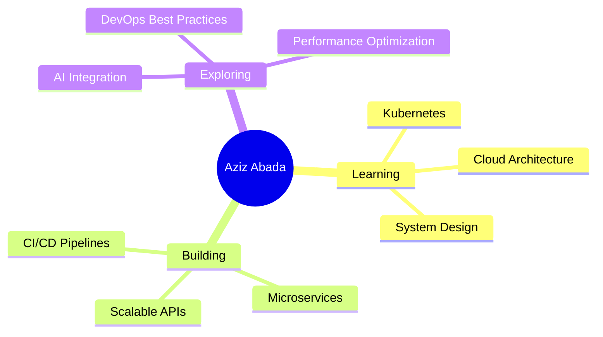

<div align="center">

# 👋 Aziz Abada

### Full Stack Web Developer | Digital Architect | Problem Solver


[](https://linkedin.com/in/azizabada)
[](https://azizabada.dev)
[](mailto:aziz@example.com)

</div>

---

## 🎯 About Me

```javascript
const aziz = {
    location: "Casablanca, Morocco 🇲🇦",
    education: "YouCode | Full Stack Development",
    currentFocus: ["Cloud Architecture", "Microservices", "DevOps"],
    learning: ["Kubernetes", "System Design", "Advanced Algorithms"],
    passion: "Turning complex problems into elegant solutions",
    funFact: "I debug code faster than I debug my life choices ☕"
};
```

> 💡 **Philosophy:** *"Code is like humor. When you have to explain it, it's bad."* – Cory House

---

## 🛠️ Tech Arsenal

<details open>
<summary><b>🎨 Frontend Development</b></summary>
<br>


</details>

<details open>
<summary><b>⚙️ Backend Development</b></summary>
<br>


</details>

<details open>
<summary><b>🗄️ Database & Storage</b></summary>
<br>


</details>

<details open>
<summary><b>☁️ DevOps & Cloud</b></summary>
<br>


</details>

<details open>
<summary><b>🔧 Tools & Platforms</b></summary>
<br>


</details>

---

## 📊 GitHub Analytics

<div align="center">
  
  
</div>

<div align="center">
  
</div>

<div align="center">
  
</div>

---

## 🏆 Achievements

<div align="center">


</div>

---

## 🎯 Current Focus



---

## 📈 Contribution Graph

<div align="center">


</div>

---

## 💼 Featured Projects

<div align="center">

[](https://github.com/AZIZABADA10/project1)
[](https://github.com/AZIZABADA10/project2)

</div>

---

## 🤝 Let's Connect

<div align="center">

[](https://github.com/AZIZABADA10)
[](https://twitter.com/azizabada)

**Open to collaboration on innovative projects and opportunities!**

</div>

---

<div align="center">

### ⚡ *"The best way to predict the future is to invent it."* – Alan Kay


</div>

---

<div align="center">
  
**💖 Thanks for visiting! Feel free to explore my repositories and don't hesitate to reach out!**

</div>
